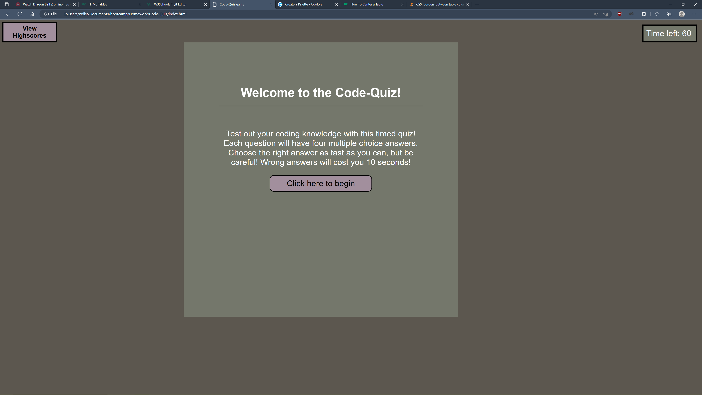
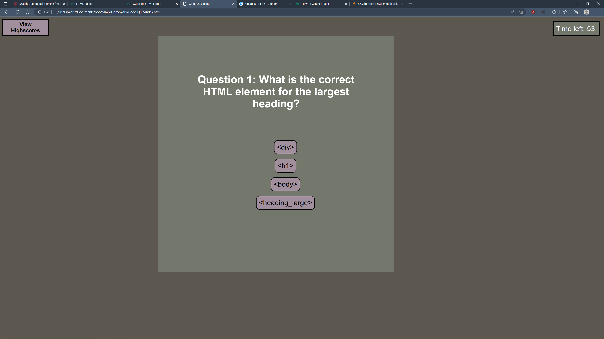
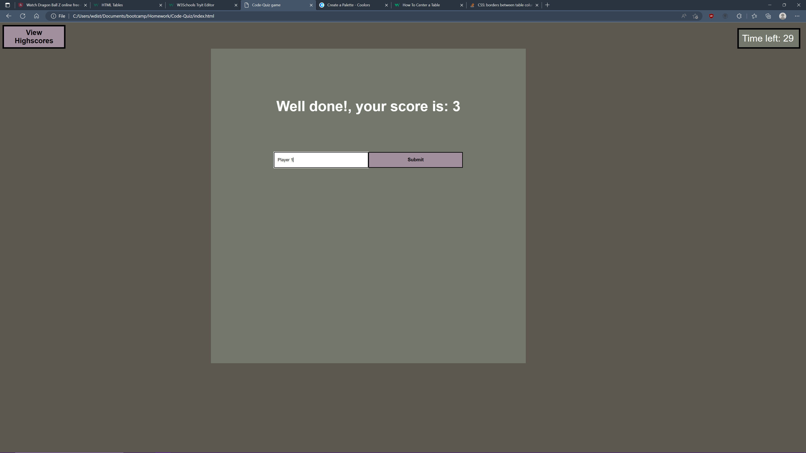
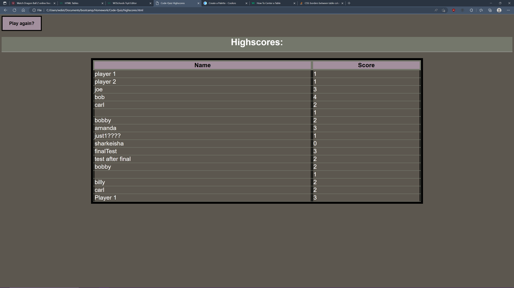

# Code Quiz
#### by William DiStefano
<hr>
<br>
<br>  

## Take a quiz to gauge your progress!

On our journey to learn fullstack, we must periodically test our knowledge against our peers.  Using this application, you can take a short quiz to either study or test yourself!

## User Story

```
AS A coding boot camp student
I WANT to take a timed quiz on JavaScript fundamentals that stores high scores
SO THAT I can gauge my progress compared to my peers
```

## What it does

```
As promised, this application will inform the user of the rules while awaiting a click of the start button.  Once the quiz has started, a timer will run showing the remaining time ro answer questions.  A question will appear along with 4 multiple choice answers which will increase the user's score (with a correct answer) and move to the next question.  If either the user finishes all questions or time runs out, an input box will be provided to input data into a highscores page and save it locally.
```

<br>

### Examples:

> Starting the application



> Clicking start button begins the quiz!



> User prompted to enter name for logging of highscore after quiz has ended.  Quiz can end when time runs out or when all answers are submitted



> This is a look at the highscores page populated with locally stored data



